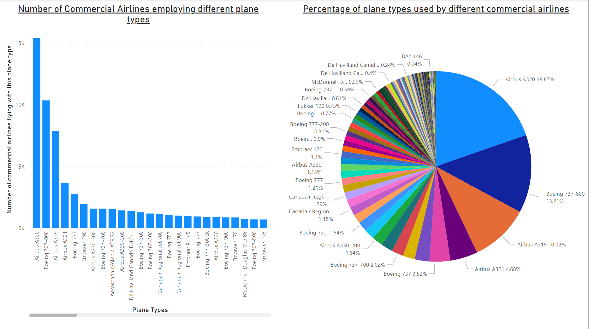
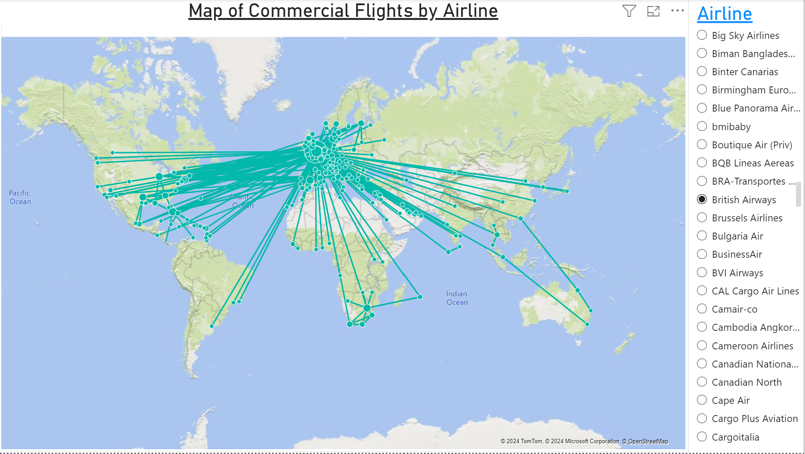
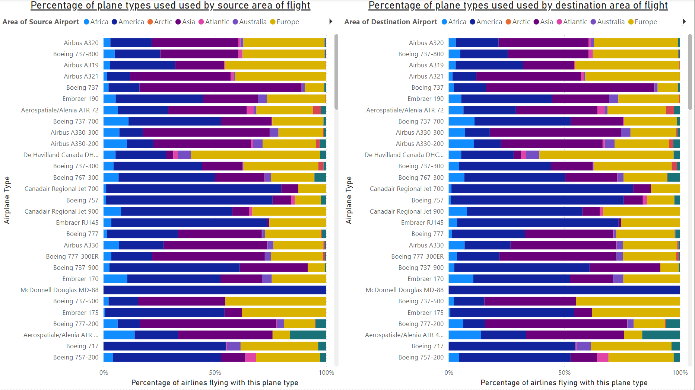

## Visualization of Commercial Flights by Plane Types and Regions                                                                        

* Source of Raw Data: https://openflights.org/data.php 
* Visualisation is on `Open_Flights.pbix`, created on Power BI.
* There are two transformed data sets i.e. processed data after an ETL pipeline created on Azure Data Factory (Extraction) and Azure Databricks (Transformation). `routes_equip_final.csv` contains all the commercial routes including the airplane type operating on that route; `routes_equip_final.csv` does not.

## About the dashboards
Unfortunately, the dashboards cannot be opened if you don't have Power BI downloaded locally on your computer.

---

* Dashboard 1 - Charts depicting the frequency of different plane types across all commercial airlines.

---

* Dashboard 2 - An interactive map showing the commercial routes operated by every commercial airline.

---

* Dashboard 3 - Proportional Bar Graphs demonstrating the relative usage of different plane types across all areas around the world.
